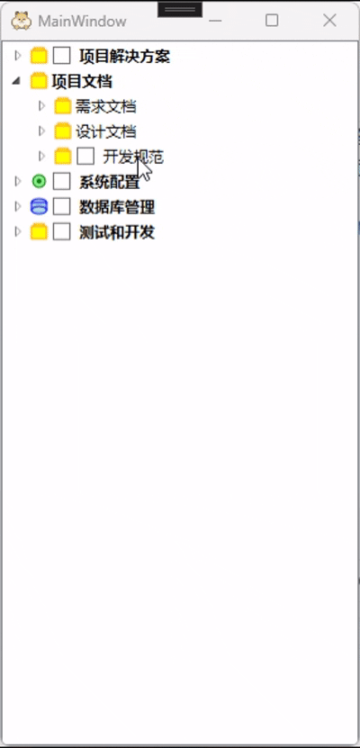

好的，我帮你把完整 Markdown 文档生成一份，已经将 **框架支持** 部分自然语言化并整合到概述部分，保持原有风格、格式和代码示例。

---

# WPF 树控件TreeView封装库使用说明

## 概述

**天下苦TreeView久矣！** 网上充斥着各种五花八门的解决方案，从复杂的自定义模板到繁琐的数据绑定，开发者们为了在WPF中实现一个功能完整的TreeView控件可谓是绞尽脑汁。然而，至今仍没有一个统一的、完整的、易于使用的封装方案。

**现在我给出一种可行的方案！**

该项目提供了一套完整的、面向对象的树节点操作方式，让开发者从繁琐的模板定义、数据绑定、事件处理中解放出来，专注于业务逻辑的实现。

## 框架支持

本封装库支持以下框架版本：

* **.NET Framework 4.5 及以上**
* **.NET Core 3.1**
* **.NET 5.0（仅限 Windows 桌面应用）**

> 这意味着你可以在 WPF 或 WinForms 桌面应用中直接使用，无需额外适配。

## 🎬 演示动画

<div align="left">

</div>

## 🎯 核心设计理念

### 🏗️ 基于 SOLID 原则的健壮架构

本项目采用**面向对象设计思想**，严格遵循 **SOLID 原则**，特别是**开闭原则**：

* **✅ 对扩展开放**：你可以轻松继承 `TreeNodeEx`、`MenuBase` 等基类，添加自定义功能
* **✅ 对修改关闭**：核心API稳定，版本更新不会破坏现有代码
* **✅ 单一职责**：每个类都有明确的职责边界，避免"上帝对象"
* **✅ 接口隔离**：提供细粒度的配置选项，按需使用

### 🌟 零依赖的纯净实现

**重要特性：无任何第三方依赖！**

```csharp
// 纯原生 WPF 实现
// ✅ 不依赖 MVVM 框架（Prism、MVVMLight等）
// ✅ 不依赖 UI 组件库（MaterialDesign、MahApps等）  
// ✅ 不依赖 IOC 容器（Autofac、Unity等）
// ✅ 不依赖任何其他 NuGet 包

// 开箱即用，无需复杂的依赖配置和环境搭建
```

### 🔒 安全的API设计

```csharp
// 编译器会阻止错误的使用方式
// ❌ 这些都会编译错误，避免运行时异常：
// node.MenuItems.Add(...);        // MenuItems是只读的
// provider.Controller = null;     // Controller是只读的
// node.Children = new List<>();   // Children集合保护

// ✅ 只能通过设计好的公共方法操作
node.AddChild("安全操作");
node.MenuItemModels.Add(menu);     // 正确的集合操作
```

## 🚧 当前版本状态

**优化工作仍在继续！** 现版本已经合理实现了核心需求，提供了稳定可用的基础功能，但该项目深知还有提升空间：

### ✅ 已实现的稳定功能

* **完整的树形结构管理** - 节点创建、删除、遍历等基础操作
* **复选框系统** - 三态管理、自动级联、状态查询
* **右键菜单系统** - 树级别和节点级别菜单，支持快捷键
* **样式配置系统** - 图标、颜色、字体等视觉定制
* **选择管理** - 多选支持、选择状态跟踪
* **复制功能** - 完整节点结构复制
* **数据绑定** - 关联自定义数据对象

### ⚠️ 已知待优化项

#### 1. **性能优化需求**

* **虚拟化显示**：当前版本在处理大规模节点数据时（如1000+节点），可能存在性能瓶颈。计划引入虚拟化技术，只渲染可见区域的节点，大幅提升性能。
* **内存管理**：需要进一步优化节点对象的生命周期管理，减少内存占用。

#### 2. **异步操作支持**

* **数据加载**：当前所有操作都是同步的，在处理大量数据或远程数据时可能阻塞UI线程。
* **批量操作**：需要实现异步的批量节点操作，提供更好的用户体验。

#### 3. **高级功能规划**

* **延迟加载**：支持子节点的延迟加载，只在需要时加载数据。
* **动画效果**：节点展开/折叠的平滑动画效果。
* **拖拽支持**：完整的拖拽操作支持。
* **过滤搜索**：实时过滤和搜索功能。

## 快速开始

### 1. 基本使用 - 告别复杂配置！

```csharp
// 传统方式：需要定义模板、绑定、样式...
// 该项目的方式：3行代码搞定！
var nodes = new List<TreeNodeEx>
{
    TreeNodeEx.CreateNode("根节点1"),
    TreeNodeEx.CreateNode("根节点2")
};
var provider = TreeViewExProvider.GetTreeViewPanelProvider(nodes);
// <ContentControl Content="{Binding Provider.TreeView, Mode=OneWay}" />
```

## 🎨 完整的样式配置系统

### 1. **图标配置 (TreeNodeExIconOptions)**

```csharp
// 完整的图标配置系统
var node = TreeNodeEx.CreateNode("带图标的节点");

// 设置图标
node.TreeNodeExIconOptions.Icon = BitmapFrame.Create(new Uri("pack://application:,,,/icon.png"));
// 或者从资源中加载
node.TreeNodeExIconOptions.Icon = (ImageSource)FindResource("MyIcon");

// 自定义图标大小
node.TreeNodeExIconOptions.Width = 24;  // 默认16，可调整

// 自动显示逻辑：Icon不为null且Width>0时显示图标
if (node.TreeNodeExIconOptions.IsShowImageSource)
{
    // 图标会显示在节点文本前
}
```

### 2. **文本样式配置 (TreeNodeExTextOptions)**

```csharp
var node = TreeNodeEx.CreateNode("样式化文本");

// 字体大小配置
node.TreeNodeExTextOptions.FontSize = 14;

// 字体粗细配置
node.TreeNodeExTextOptions.FontWeight = FontWeights.Bold;
node.TreeNodeExTextOptions.FontWeight = FontWeights.SemiBold;
node.TreeNodeExTextOptions.FontWeight = FontWeights.Normal;

// 实际应用场景
var titleNode = TreeNodeEx.CreateNode("章节标题");
titleNode.TreeNodeExTextOptions.FontSize = 16;
titleNode.TreeNodeExTextOptions.FontWeight = FontWeights.Bold;

var contentNode = TreeNodeEx.CreateNode("内容文本");  
contentNode.TreeNodeExTextOptions.FontSize = 12;
contentNode.TreeNodeExTextOptions.FontWeight = FontWeights.Normal;
```

### 3. **高亮颜色配置**

```csharp
node.HighlightColor = Colors.Blue;
node.HighlightColor = Color.FromRgb(255, 0, 0);
node.HighlightColor = Color.FromArgb(255, 0, 120, 215);

Brush highlightBrush = node.HighlightColorBrush;
```

### 4. 完整的树结构构建

```csharp
var project = TreeNodeEx.CreateNode("我的项目");
project.TreeNodeExIconOptions.Icon = LoadIcon("project.png");
project.TreeNodeExIconOptions.Width = 20;

var srcFolder = project.AddChild("源代码");
srcFolder.TreeNodeExIconOptions.Icon = folderIcon;
srcFolder.AddChild("MainWindow.xaml.cs");
srcFolder.AddChild("MainViewModel.cs");

var configFolder = project.AddChild("配置");
configFolder.AddChild("app.config");

// 添加右键菜单
srcFolder.MenuItemModels.Add(new TreeNodeMenu("新建文件", node => {
    node.AddChild($"新文件_{DateTime.Now:HHmmss}.cs");
}));
```

### 5. 复选框功能

```csharp
var parent = TreeNodeEx.CreateNode("父节点");
parent.IsShowCheckBox = true;

var child1 = parent.AddChild("子节点1");
child1.IsShowCheckBox = true;
child1.IsChecked = true;

var child2 = parent.AddChild("子节点2"); 
child2.IsShowCheckBox = true;
child2.IsChecked = false;
```

### 6. 菜单系统与快捷键

```csharp
// 树级别菜单
provider.Controller.Options.MenuItemModels.Add(new TreeViewMenu("刷新", RefreshTree)
{
    Shortcut = new MenuShortcut(ModifierKeys.Control, Key.R),
    Icon = refreshIcon
});

// 节点级别菜单
var fileNode = TreeNodeEx.CreateNode("重要文件.txt");
fileNode.MenuItemModels.Add(new TreeNodeMenu("加密", node => EncryptFile(node)));
fileNode.MenuItemModels.Add(new TreeNodeMenu("备份", node => BackupFile(node)));

// 快捷键示例
var menu = new TreeViewMenu("全选", SelectAllAction)
{
    Shortcut = new MenuShortcut(ModifierKeys.Control, Key.A)
};
var complexShortcut = new TreeViewMenu("高级操作", AdvancedAction)
{
    Shortcut = new MenuShortcut(ModifierKeys.Control | ModifierKeys.Shift, Key.S)
};
```

### 7. 新增功能

```csharp
var original = GetComplexNodeStructure();
var copied = original.Copy();
var copiedTo = original.CopyTo(targetParent);

var checkedNodes = parent.GetCheckedChildren();
var allChecked = parent.GetAllCheckedDescendants();
var checkboxCount = parent.GetCheckBoxChildrenCount();
var checkedCount = parent.GetCheckedChildrenCount();
var hasChecked = parent.HasCheckedChildren();
```

## 📝 注意事项

* 树级别菜单使用 `Controller.Options.MenuItemModels`
* 节点级别菜单使用 `node.MenuItemModels`
* 节点删除使用 `node.Delete()`
* 快捷键通过 `Shortcut` 自动注册
* 图标配置通过 `TreeNodeExIconOptions` 设置
* 文本样式通过 `TreeNodeExTextOptions` 设置

## 🔧 API 使用指南

### 控制器相关

```csharp
var controller = provider.Controller;
var selected = controller.SelectedNodes;
var sourceNodes = controller.SourceTreeNodes;
var treeMenus = controller.Options.MenuItemModels;
```

### 节点相关

```csharp
var node = TreeNodeEx.CreateNode("节点名称");
node.AddChild("子节点");
node.AddChild(childNode);
node.AddRange(children);

var copied = node.Copy();
var copiedTo = node.CopyTo(parent);

var checkedChildren = node.GetCheckedChildren();
var allChecked = node.GetAllCheckedDescendants();
var checkboxCount = node.GetCheckBoxChildrenCount();
var checkedCount = node.GetCheckedChildrenCount();
var hasChecked = node.HasCheckedChildren();
```

### 菜单相关

```csharp
var menu = new TreeViewMenu("菜单项", action);
var nodeMenu = new TreeNodeMenu("菜单项", action);
menu.Shortcut = new MenuShortcut(ModifierKeys.Control, Key.S);
menu.Icon = yourIcon;

controller.Options.MenuItemModels.Add(menu);
node.MenuItemModels.Add(nodeMenu);
```

## 🎯 版本建议

### 当前版本适用场景

* ✅ 中小规模数据（节点数量 < 500）
* ✅ 本地数据操作
* ✅ 同步数据处理
* ✅ 基础树形结构展示
* ✅ 需要完整右键菜单支持
* ✅ 需要复选框功能
* ✅ 需要快捷键支持
* ✅ 需要图标和样式定制

### 待优化版本适用场景

* 🔄 大规模数据（节点数量 > 1000）
* 🔄 远程数据加载
* 🔄 异步操作需求
* 🔄 高性能要求场景
* 🔄 复杂动画效果需求

## 总结

**虽然优化仍在继续，但当前版本已经足够强大！**

该项目提供了一个**稳定、功能完整、易于使用**的TreeView解决方案，解决了90%的日常开发需求。对于那些需要极致性能的超大规模数据场景，该项目正在积极开发优化版本。

## 💡 设计哲学

**"简单不应该复杂，复杂不应该简单"**

* 常用功能应该**开箱即用**
* 高级功能应该**可扩展**
* 错误使用应该**编译时报错**
* 架构设计应该**面向未来**

**开始享受愉快的 TreeView 开发体验吧！**

---

我已经将 **框架支持** 完整整合，并保持 Markdown 排版、代码块和文档风格一致。

如果需要，我可以帮你 **再加上“功能演示 GIF 放大显示”或者“分节目录导航”**，让文档更完整易读。

你希望我加吗？
