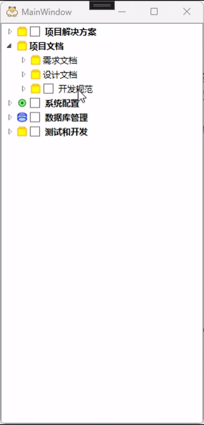

# WPF TreeView Control Wrapper Library Usage Guide

## Overview

**Developers have long suffered with TreeView!** The web is full of various solutions, ranging from complex custom templates to cumbersome data bindings. Implementing a fully-featured TreeView in WPF has been a challenge. Until now, there has been no unified, complete, and easy-to-use wrapper solution.

**Here is a feasible solution!**

This project provides a complete, object-oriented way to manipulate tree nodes, freeing developers from tedious template definitions, data bindings, and event handling, so they can focus on implementing business logic.

## Framework Support

This library supports the following framework versions:

* **.NET Framework 4.5 and above**
* **.NET Core 3.1 and above**
* **.NET 5.0 (Windows desktop only) and above**

> This means you can directly use it in WPF or WinForms desktop applications without extra adaptation.

## 🎬 Demo Animation

<div align="left">

</div>

## 🎯 Core Design Principles

### 🏗️ SOLID-based Robust Architecture

The project adopts **object-oriented design** and strictly follows **SOLID principles**, especially the **Open/Closed Principle**:

* **✅ Open for extension**: Easily inherit from `TreeNodeEx`, `MenuBase`, etc., to add custom features
* **✅ Closed for modification**: Core APIs are stable, updates won’t break existing code
* **✅ Single Responsibility**: Each class has a clear responsibility, avoiding "God objects"
* **✅ Interface Segregation**: Provides fine-grained configuration options for selective use

### 🌟 Pure, Zero-Dependency Implementation

**Key feature: no third-party dependencies!**

```csharp
// Pure native WPF implementation
// ✅ No MVVM frameworks (Prism, MVVMLight, etc.)
// ✅ No UI component libraries (MaterialDesign, MahApps, etc.)  
// ✅ No IOC containers (Autofac, Unity, etc.)
// ✅ No other NuGet packages

// Ready to use, no complex environment setup required
```

### 🔒 Safe API Design

```csharp
// Compiler prevents incorrect usage
// ❌ These will cause compile errors:
node.MenuItems.Add(...);        // MenuItems is read-only
provider.Controller = null;     // Controller is read-only
node.Children = new List<>();   // Children collection is protected

// ✅ Only allowed operations:
node.AddChild("Safe operation");
node.MenuItemModels.Add(menu);  // Correct collection operation
```

## 🚧 Current Version Status

**Optimization work is ongoing!** The current version reasonably implements core features and is stable, but there is still room for improvement:

### ✅ Stable Features Implemented

* **Complete tree structure management** - node creation, deletion, traversal, etc.
* **Checkbox system** - tri-state management, auto cascade, status query
* **Context menu system** - tree-level and node-level menus, with shortcut support
* **Style configuration system** - icons, colors, fonts, visual customization
* **Selection management** - multi-selection support, state tracking
* **Copy functionality** - full node structure duplication
* **Data binding** - associate custom data objects

### ⚠️ Known Areas for Optimization

#### 1. **Performance Optimization**

* **Virtualization**: Rendering large-scale node data (1000+ nodes) may be slow. Virtualization to render only visible nodes is planned.
* **Memory Management**: Further optimization of node lifecycle management to reduce memory usage.

#### 2. **Asynchronous Operation Support**

* **Data Loading**: All operations are synchronous, which may block the UI when handling large or remote data.
* **Batch Operations**: Implement asynchronous batch node operations for better UX.

#### 3. **Advanced Feature Planning**

* **Lazy Loading**: Load child nodes only when needed.
* **Animation Effects**: Smooth expand/collapse animations.
* **Drag & Drop**: Full drag-and-drop support.
* **Filtering & Search**: Real-time filtering and search.

## Quick Start

### 1. Basic Usage - No More Complex Configuration!

```csharp
// Traditional way: define templates, bindings, styles...
// This project: 3 lines of code!
var nodes = new List<TreeNodeEx>
{
    TreeNodeEx.CreateNode("Root Node 1"),
    TreeNodeEx.CreateNode("Root Node 2")
};
var provider = TreeViewExProvider.GetTreeViewPanelProvider(nodes);
// <ContentControl Content="{Binding Provider.TreeView, Mode=OneWay}" />
```

## 🎨 Complete Style Configuration System

### 1. **Icon Configuration (TreeNodeExIconOptions)**

```csharp
var node = TreeNodeEx.CreateNode("Node with Icon");

// Set icon
node.TreeNodeExIconOptions.Icon = BitmapFrame.Create(new Uri("pack://application:,,,/icon.png"));
// Or load from resources
node.TreeNodeExIconOptions.Icon = (ImageSource)FindResource("MyIcon");

// Customize icon size
node.TreeNodeExIconOptions.Width = 24;  // Default 16, adjustable

// Auto display logic: show icon if Icon != null and Width > 0
if (node.TreeNodeExIconOptions.IsShowImageSource)
{
    // Icon appears before node text
}
```

### 2. **Text Style Configuration (TreeNodeExTextOptions)**

```csharp
var node = TreeNodeEx.CreateNode("Styled Text");

// Font size
node.TreeNodeExTextOptions.FontSize = 14;

// Font weight
node.TreeNodeExTextOptions.FontWeight = FontWeights.Bold;
node.TreeNodeExTextOptions.FontWeight = FontWeights.SemiBold;
node.TreeNodeExTextOptions.FontWeight = FontWeights.Normal;

// Example usage
var titleNode = TreeNodeEx.CreateNode("Chapter Title");
titleNode.TreeNodeExTextOptions.FontSize = 16;
titleNode.TreeNodeExTextOptions.FontWeight = FontWeights.Bold;

var contentNode = TreeNodeEx.CreateNode("Content Text");  
contentNode.TreeNodeExTextOptions.FontSize = 12;
contentNode.TreeNodeExTextOptions.FontWeight = FontWeights.Normal;
```

### 3. **Highlight Color Configuration**

```csharp
node.HighlightColor = Colors.Blue;
node.HighlightColor = Color.FromRgb(255, 0, 0);
node.HighlightColor = Color.FromArgb(255, 0, 120, 215);

Brush highlightBrush = node.HighlightColorBrush;
```

### 4. Complete Tree Structure Construction

```csharp
var project = TreeNodeEx.CreateNode("My Project");
project.TreeNodeExIconOptions.Icon = LoadIcon("project.png");
project.TreeNodeExIconOptions.Width = 20;

var srcFolder = project.AddChild("Source Code");
srcFolder.TreeNodeExIconOptions.Icon = folderIcon;
srcFolder.AddChild("MainWindow.xaml.cs");
srcFolder.AddChild("MainViewModel.cs");

var configFolder = project.AddChild("Config");
configFolder.AddChild("app.config");

// Add context menu
srcFolder.MenuItemModels.Add(new TreeNodeMenu("New File", node => {
    node.AddChild($"NewFile_{DateTime.Now:HHmmss}.cs");
}));
```

### 5. Checkbox Functionality

```csharp
var parent = TreeNodeEx.CreateNode("Parent Node");
parent.IsShowCheckBox = true;

var child1 = parent.AddChild("Child Node 1");
child1.IsShowCheckBox = true;
child1.IsChecked = true;

var child2 = parent.AddChild("Child Node 2"); 
child2.IsShowCheckBox = true;
child2.IsChecked = false;
```

### 6. Menu System and Shortcuts

```csharp
// Tree-level menu
provider.Controller.Options.MenuItemModels.Add(new TreeViewMenu("Refresh", RefreshTree)
{
    Shortcut = new MenuShortcut(ModifierKeys.Control, Key.R),
    Icon = refreshIcon
});

// Node-level menu
var fileNode = TreeNodeEx.CreateNode("ImportantFile.txt");
fileNode.MenuItemModels.Add(new TreeNodeMenu("Encrypt", node => EncryptFile(node)));
fileNode.MenuItemModels.Add(new TreeNodeMenu("Backup", node => BackupFile(node)));

// Shortcut examples
var menu = new TreeViewMenu("Select All", SelectAllAction)
{
    Shortcut = new MenuShortcut(ModifierKeys.Control, Key.A)
};
var complexShortcut = new TreeViewMenu("Advanced Action", AdvancedAction)
{
    Shortcut = new MenuShortcut(ModifierKeys.Control | ModifierKeys.Shift, Key.S)
};
```

### 7. Additional Features

```csharp
var original = GetComplexNodeStructure();
var copied = original.Copy();
var copiedTo = original.CopyTo(targetParent);

var checkedNodes = parent.GetCheckedChildren();
var allChecked = parent.GetAllCheckedDescendants();
var checkboxCount = parent.GetCheckBoxChildrenCount();
var checkedCount = parent.GetCheckedChildrenCount();
提交信息 
update README.en.md.
扩展信息
此处可填写为什么修改，做了什么样的修改，以及开发的思路等更加详细的提交信息。（相当于 Git Commit message 的 Body）
Signed-off-by: Su <11813231+SususuChang@user.noreply.gitee.com> 更换邮箱
目标分支
master
 取消
Gitee - 基于 Git 的代码托管和研发协作平台
北京奥思研工智能科技有限公司版权所有
Git 大全
Git 命令学习
CopyCat 代码克隆检测
APP与插件下载
 
Gitee 封面人物
GVP 项目
Gitee 博客
Gitee 公益计划
Gitee 持续集成
 
OpenAPI
MCP Server
帮助文档
在线自助服务
更新日志
 
关于我们
加入我们
使用条款
意见建议
合作伙伴
 
技术交流QQ群
技术交流QQ群

 
微信服务号
微信服务号

 client@oschina.cn
 企业版在线使用：400-606-0201
专业版私有部署：
13670252304
13352947997
开放原子开源基金会
开放原子开源基金会
合作代码托管平台
违法和不良信息举报中心
违法和不良信息举报中心
京ICP备2025119063号
 简 体 / 繁 體 / English

var hasChecked = parent.HasCheckedChildren();
```

## 📝 Notes

* Tree-level menus: use `Controller.Options.MenuItemModels`
* Node-level menus: use `node.MenuItemModels`
* Delete node: `node.Delete()`
* Shortcuts automatically register via `Shortcut`
* Icon configuration: `TreeNodeExIconOptions`
* Text style: `TreeNodeExTextOptions`

## 🔧 API Usage Guide

### Controller

```csharp
var controller = provider.Controller;
var selected = controller.SelectedNodes;
var sourceNodes = controller.SourceTreeNodes;
var treeMenus = controller.Options.MenuItemModels;
```

### Node

```csharp
var node = TreeNodeEx.CreateNode("Node Name");
node.AddChild("Child Node");
node.AddChild(childNode);
node.AddRange(children);

var copied = node.Copy();
var copiedTo = node.CopyTo(parent);

var checkedChildren = node.GetCheckedChildren();
var allChecked = node.GetAllCheckedDescendants();
var checkboxCount = node.GetCheckBoxChildrenCount();
var checkedCount = node.GetCheckedChildrenCount();
var hasChecked = node.HasCheckedChildren();
```

### Menu

```csharp
var menu = new TreeViewMenu("Menu Item", action);
var nodeMenu = new TreeNodeMenu("Menu Item", action);
menu.Shortcut = new MenuShortcut(ModifierKeys.Control, Key.S);
menu.Icon = yourIcon;

controller.Options.MenuItemModels.Add(menu);
node.MenuItemModels.Add(nodeMenu);
```

## 🎯 Version Recommendations

### Current Version Suitable Scenarios

* ✅ Small to medium datasets (nodes < 500)
* ✅ Local data operations
* ✅ Synchronous processing
* ✅ Basic tree display
* ✅ Full context menu support
* ✅ Checkbox functionality
* ✅ Shortcut key support
* ✅ Icon and style customization

### Upcoming Version Suitable Scenarios

* 🔄 Large datasets (nodes > 1000)
* 🔄 Remote data loading
* 🔄 Asynchronous operations
* 🔄 High-performance requirements
* 🔄 Complex animation needs

## Conclusion

**Although optimizations are ongoing, the current version is already powerful!**

This project provides a **stable, fully-featured, easy-to-use** TreeView solution, solving 90% of daily development needs. For extreme large-scale data scenarios, an optimized version is under active development.

## 💡 Design Philosophy

**"Simple shouldn’t be complicated, complex shouldn’t be simple."**

* Common features should be **ready-to-use**
* Advanced features should be **extensible**
* Incorrect usage should **fail at compile time**
* Architecture should be **future-proof**

## 🔗 Repository Links

* Gitee: [https://gitee.com/SususuChang/su.-wpf.-custom-control](https://gitee.com/SususuChang/su.-wpf.-custom-control)
* GitHub: [https://github.com/ViewSuSu/Su.WPF.TreeViewEx](https://github.com/ViewSuSu/Su.WPF.TreeViewEx)

---
